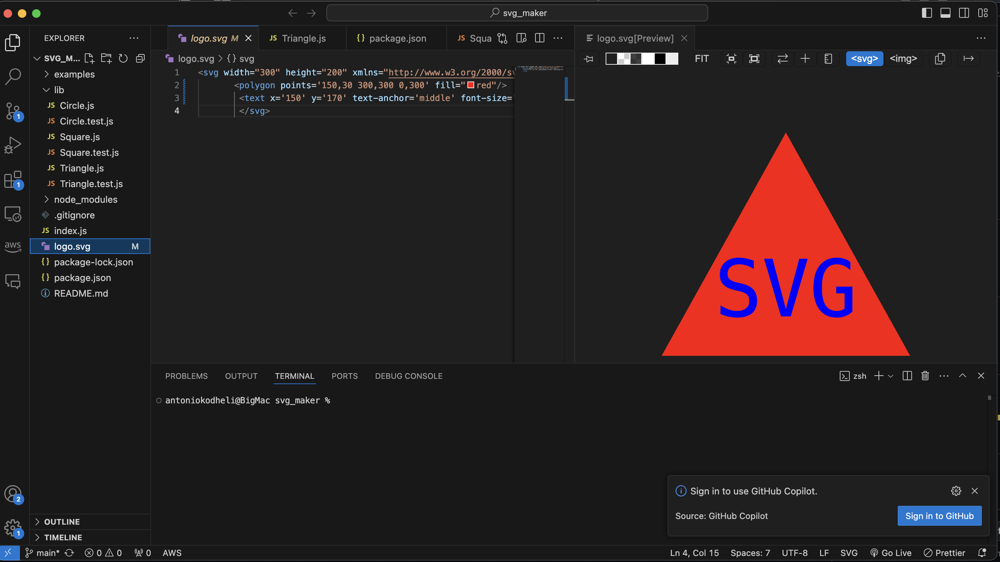

  
  # SVG Maker
  
  
  ## Description
  
  This project is a CLI application that accepts user input to create an SVG of a basic shap
e like a triangle, circle, and square and puts text on the middle of the SVG

  ## Table Of Contents
  1. [Installation](#installation)
  2. [Usage](#usage)
  3. [License](#license)
  4. [Contribute](#contributing)
  6. [Questions](#questions)

  ## Installation 

  To install this project you can clone the repo and then open the project in your preferred editor and on the termina run node index and it will start the applitcation

  ## Usage

  
  

  ## License

  
  [MIT License](https://opensource.org/licenses/MIT)

  ## Contributing

  To contribute on my project you can clone it or fork it to push new features and also create issues for it to see how we can make it better

  ## Questions 

  [antonio_kodheli@icloud.com](mailto:antonio_kodheli@icloud.com)

  [My Github](https://github.com/AntonioKOD)

